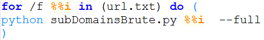
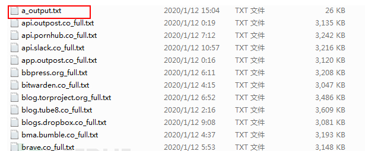
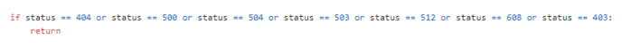
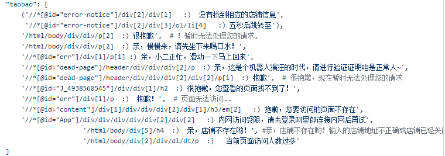
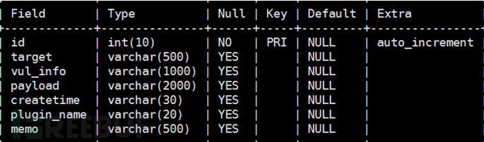
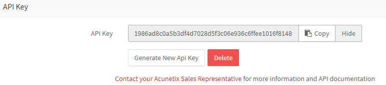

## Date 

2019.12


## 设计思路

子域名获取->页面访问去重->子域名任务分发到awvs,并自动部署不同代理(代理为部署了多台xray的内网服务器)->xray分布式跑结果->上传检测成功至云端数据库，并发送wx通知。


## 具体实现

### 数据预处理

1.子域名搜集

这里我使用 [lijiejie 子域名采集](https://github.com/lijiejie/subDomainsBrute) 

2.批量扫描域名获取子域名

将```lijiejie批量.bat``` 放在```lijijie```工具目录下，运行```lijiejie批量.bat```文件。



3.批量处理子域名   

运行```批量处理子域名文件(10k).bat```

此步骤作用为：扫描出来的子域名文件大小<10k的复制到一个txt中（a_output.txt）。文件大小>=10k 的 剪切到 当前目录 “1” 文件夹下，下一步对这些大文件进行清洗。




4.子域名清洗

1）. 去掉无法访问的子域名，

简单写了一些状态码，排除掉：



	python3 statusCodeClean.py -f  url_full.txt

转化成bat文件。 ```batchStatusCodeClean.bat```   批量执行状态码清洗

2). 去重复。比如淘宝的资产，去掉一些重复的店铺和由于高并发访问导致的验证码页面，这些页面是一个模板，只需要扫描一个就行了。



	python3 subdomainClean.py -f url_1_full.txt

转化成bat文件。 ```batchCleanSubdomain.bat```   批量执行子域名清洗


### 数据库搭建

4.存储服务器搭建数据库

简单设计了一下要存储的字段



	数据库创建语句见 xray sql.txt

5.开启 webhook


### 部署扫描器

6.采用批量连接ssh(我这里部署到10台本地服务器上)，批量上传扫描器和配置文件，批量启动扫描器。

	xray_deploy_in_onekey.py

7.使用 awvs 12 用api调用,找到api并复制。



用上面的脚本模拟给awvs配置xray代理。

8.任务分发

给前面部署的扫描器分发任务，每10秒awvs 给每个扫描器分配一个任务。

	awvs_proxy.py

### 躺着收割

躺着让服务器自己跑就完事了。

### 后记

因为没时间和懒又追求效率，所以想把自动化做更好。

做完以后发现自己还是很懒，每次过滤子域名需要打开几个url看看页面区别，提取xpath，懒得弄。

还是把代码贡献出来。怎么说也费心调试了几个晚上。

最后，本人水平有限，欢迎探讨。